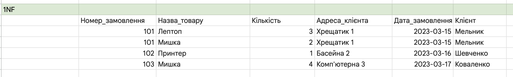
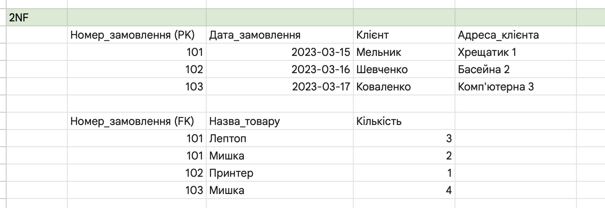
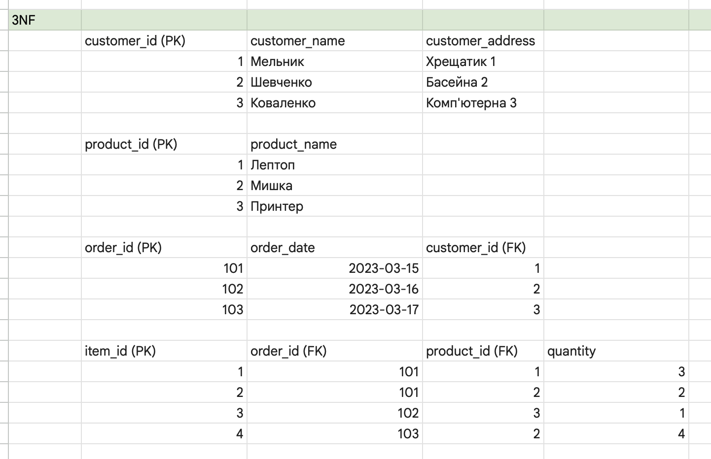
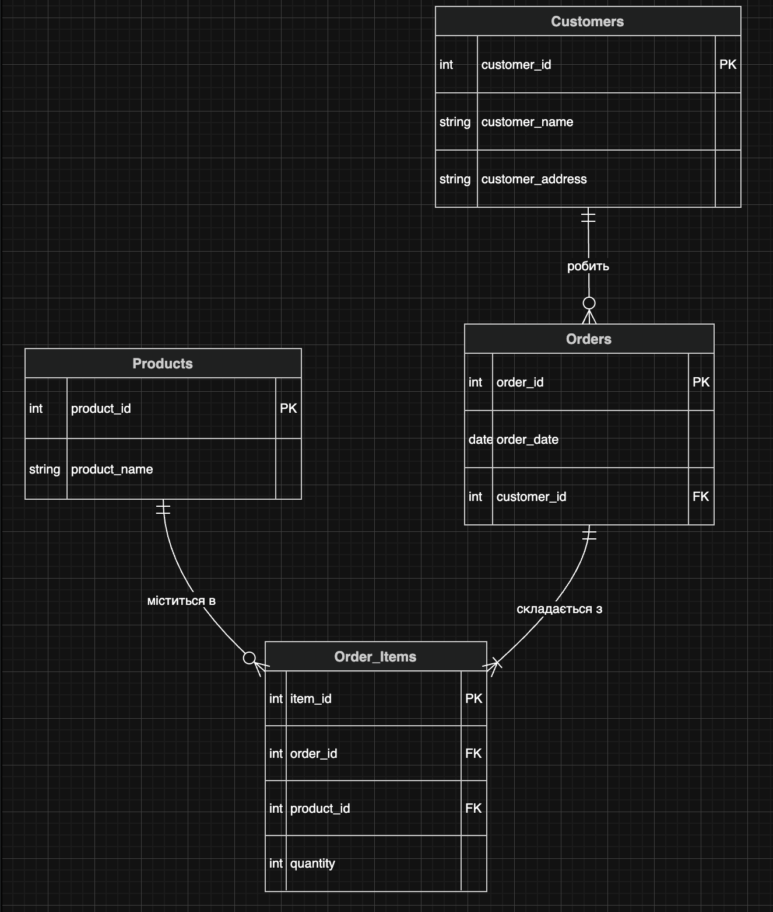
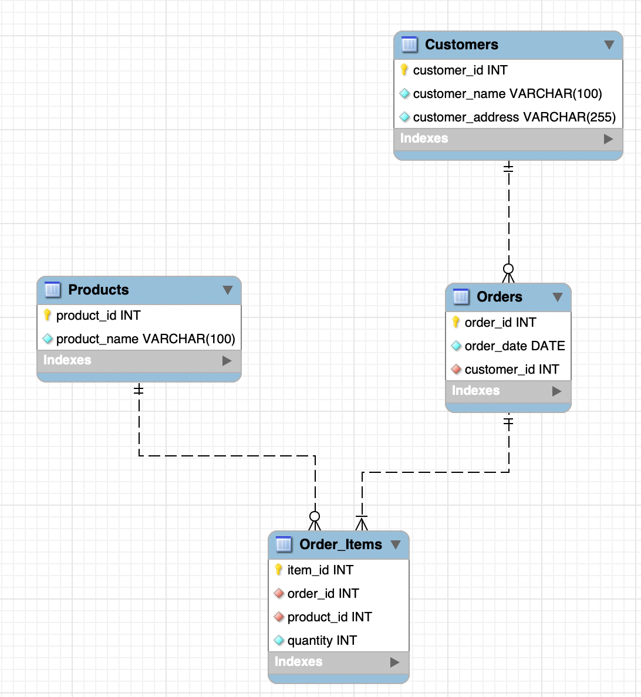
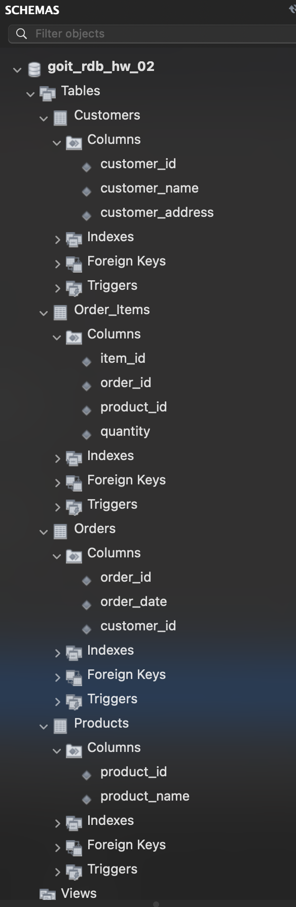

# Домашнє завдання ло теми №2: Проєктування та нормалізація бази даних

Основна мета роботи — нормалізація «брудної» таблиці замовлень до третьої нормальної форми (3НФ) та її реалізація в системі MySQL.

## 📌 Опис проєкту
В ході виконання завдання було проведено декомпозицію вихідних даних про замовлення клієнтів, створено логічну модель (ER-діаграму) та фізичну схему бази даних.

---

## 🛠 Етапи нормалізації

### 1. Перша нормальна форма (1НФ)
**Дія:** Усунено списки товарів у ячейках. Кожна позиція замовлення виділена в окремий рядок. Забезпечено атомарність даних.
- **Файл:** `p1_1NF.png`

### 2. Друга нормальна форма (2НФ)
**Дія:** Виявлено та усунено часткові залежності. Дані розділено на дві таблиці: «Замовлення» (загальна інформація) та «Деталі замовлення» (склад товарів).
- **Файл:** `p2_2NF.png`

### 3. Третя нормальна форма (3НФ)
**Дія:** Усунено транзитивні залежності. Адреси клієнтів та назви товарів винесені в окремі довідники. Це дозволяє уникнути аномалій при оновленні даних.
- **Файл:** `p3_3NF.png`

---

## 📊 Візуалізація структури

### Логічна ER-діаграма (нотація Crow's Foot)
Діаграма відображає зв'язки між сутностями, ключі (PK/FK) та кардинальність (обов'язковість зв'язків).
- **Зв'язок Клієнт-Замовлення:** 1 до багатьох (клієнт може мати 0 або більше замовлень).
- **Зв'язок Товар-Позиція:** 1 до багатьох (товар може бути в багатьох замовленнях або жодному).

### Фізична схема (MySQL Workbench)
Скріншот відображає реальну структуру таблиць у БД з урахуванням типів даних та обмежень зовнішніх ключів.

